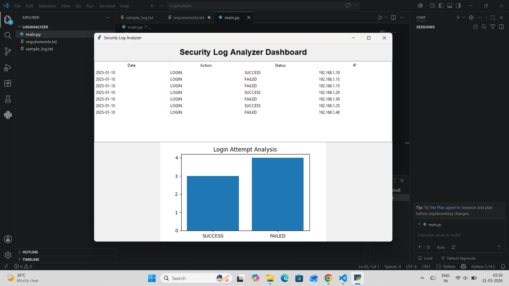

# security-log-analyzer-dashboard
GUI application for analyzing security logs and detecting failed login attempts.
# Security Log Analyzer Dashboard

A GUI-based Security Log Analyzer built with Python for monitoring login activity and detecting failed login attempts.

## Features

- Login activity monitoring
- Failed login detection
- Interactive GUI dashboard
- Security event visualization
- Log file analysis

## Technologies Used

- Python
- Tkinter
- Pandas
- Matplotlib

## Project Structure

```text
LogAnalyzer
├── main.py
├── sample_log.txt
├── requirements.txt
└── screenshot.png
```

## Installation

```bash
python -m pip install pandas matplotlib
```

## Run the Project

```bash
python main.py
```

## Screenshot



## Author

Developed as a cybersecurity and log analysis project using Python.
